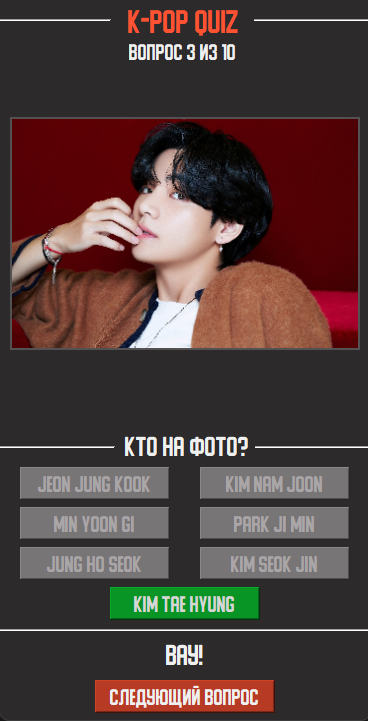
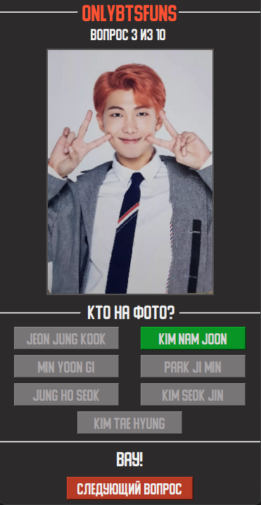

# Quiz about the most famous k-pop group❓
**A desktop quiz app dedicated to the members of the k-pop group BTS.**  
*Contains questions such as - Guess by photo (photo and 7 answer choices).*

## Technologies and construction🐍

Language: Python  

*The modules were used:*
- simple_image_download - to upload images
- xml - to create and work with information 
- PyQT5 - to build the interface
- win32gui - to work with the font

*Directories:*
- folder helpers(not necessary for the program to work):  
  - download_images.py - for download images from google pictures, creates a folder named simple_images  
  - rename_directories - rename directory  
  - create_xml - creating xml file with ids, answer, images_path data (images stores in resources/images)  
- folder resources stores all static files  
- folder ui stores generated ui files by designer PyQT5  
- DataModel helps with data(get Count, get Question by id)  
- main - the program itself

## Screenshots🖼

  
  
  

## Notes✍️
This program was written for training, so it can have a lot of flaws.

## License📝
      Copyright 2021 JustCircle Prod. (Vadim Karchagin)

      Licensed under the Apache License, Version 2.0 (the "License");
      you may not use this file except in compliance with the License.
      You may obtain a copy of the License at

         http://www.apache.org/licenses/LICENSE-2.0

      Unless required by applicable law or agreed to in writing, software
      distributed under the License is distributed on an "AS IS" BASIS,
      WITHOUT WARRANTIES OR CONDITIONS OF ANY KIND, either express or implied.
      See the License for the specific language governing permissions and
      limitations under the License.